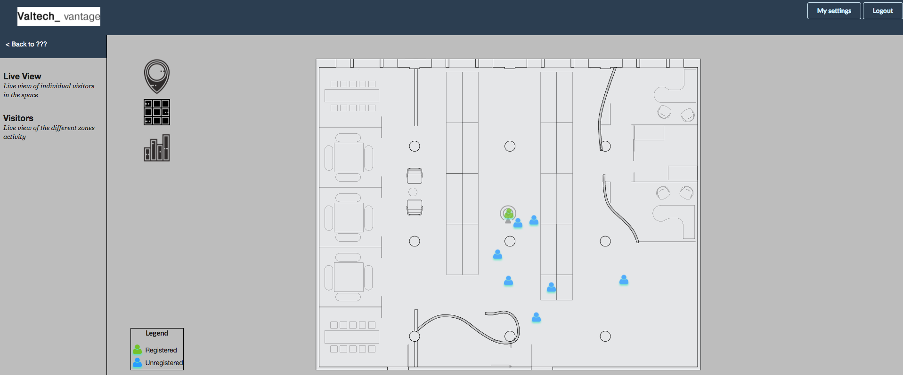

## What is ScriptEd?

ScriptEd equips students in under-resourced schools with the fundamental coding skills and professional experiences that together create access to careers in technology.

---

## Who was the intern?

---

## What was the project?

Standard Demo Project for valtech_vantage

---

## What did we build?

---

## What did we learn?

---

I know more and less than I thought.

---

Kids are capable of being self-driven and responsible if given the opportunity.

---

Being an effective leader is about managing uncertainty.

---

## What's next?

Volunteering starts in September.

Interns return next year?

---

Volunteering begins in September.

**Interested?** Talk to me!
