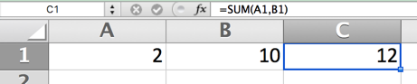
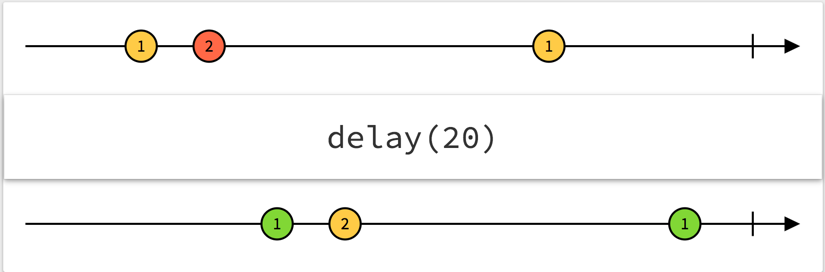

## Our first metaphor: Excel

---



---

Cells can be independent values

A1 is "2", B1 is "10"

---

Cells can also be formulas dependent on other cells

C1 is "=SUM(A1, B1)"

If A1 or B1 changes, C1 changes in response

---

We can consider Observables the same way

`first$` & `second$` are Excel cells, holding the value of each input field

---

Observables can represent the current data

Data can be derived from other data with functions

Observables can be combined to create new streams of data

---

`combine` (`combineLatest` in RxJS) represents the dependent calculation

```js
Kefir.combine({ f: first$, s: second$, op: operation$ }, ({ f, s, op }) => {
    if (Number.isNaN(f) || Number.isNaN(s)) {
        return 'ERR'
    }
    
    switch (op) {
        case '+':
            return f + s
        case '-':
            return f - s
        case '*':
            return f * s
        case '/':
            return f / s
        default:
            return `${op} is not a valid operation`
    }
})
```

---

### It turns your events into data

Any state in your application can be represented this way

---

## Our second metaphor: Arrays Over Time


"push-based collection" 

---

Push-based: Producer pushes values as they happen

vs.

Pull-based: Consumer pulls values when they can be processed

e.g. generators (`next`)

---

We also have a collection data structure in JavaScript: the array

---

Values are discrete events



[RxMarbles.com](http://rxmarbles.com/)

---

```js
Kefir.fromEvents(document.body, 'mousemove')
    .takeUntilBy(Kefir.fromEvents(document.body, 'mouseup'))
    .map(e => ({
        x: e.movementX,
        y: e.movementY
    }))
    .scan((acc, movement) => ({
        left: acc.left + movement.x,
        top: acc.top + movement.y
    }), start)
```

"Take events from A until I get an event from B"

---

### Coordinating events is simplified

---

### Let's Look at Code Again
